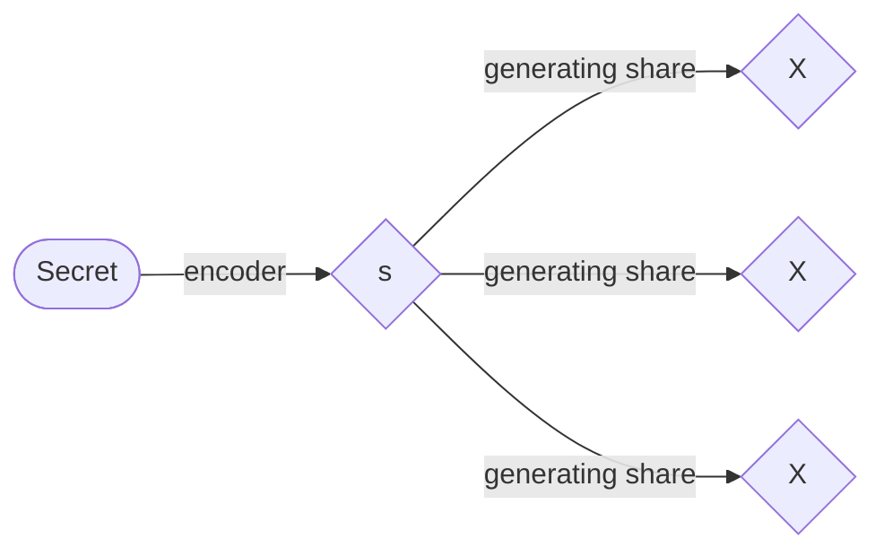

# 秘密分散法(Secret Sharing)

## 概要
秘密分散方式は、情報の秘密保持に関するかなり基礎的な理論に基づくセキュリティ技術です。情報漏洩への耐性は、この分野で最も注目されている研究テーマの一つであり、暗号学分野の著名な国際会議であるCRYPTOでは、毎年この研究に関する論文が発表されています。

## The secret sharing scheme
秘密分散方式は、秘密情報を分散して管理するための方式である。分散された後の情報は、一般に「シェア」と呼ばれる。例えば、メッセージを秘密裏に送受信する場合、実際にはシェアが分散して送受信されるため、受信者が送信された情報を見たとしても、元のメッセージは分からない。ただし、受信側で元のメッセージを復元できるように、シェアを設定する必要があるのは言うまでもない。
このプロセスを以下に簡単に説明する。まず、秘密情報を有限体 $`\mathbb{F}_{p}`$ 上の整数として符号化する。最初のステップは、秘密情報を有限体 $`\mathbb{F}_{p}`$ 上の整数として符号化することであり、ここで $`p`$ は素数である。有限体の詳細な説明は割愛しますが、体に関する詳細な解説は
>『ガロア理論12講 概念と直観でとらえる現代数学入門』（加藤 文元、2022年）

を参照してみてください。ここで $`\mathbb{F}_{p}=\lbrace0,1,\ldots,p-1\rbrace`$ であり、4つの算術演算が $`p`$ の剰余演算（モジュロ演算）を用いて定義されることで、この集合上で閉じていることを理解すれば十分です。$`s`$ を符号化された整数値、$`n`$ をシェアの数、すなわち $`s`$ の分割の数としましょう。$`n=3`$ の場合のシェア生成プロセスのイメージは、次のようになります。

## How to encode for $(n-1,n)$ threshold scheme
The 1~n-2 shares are generated according to a uniform random numbers.
Let $X_{n-1}$ and $X_n$ be the shares of the n-1th and nth participant, and these are generated to satisfy the following simultaneous equations.

$$
s+\sum_{i=0}^nX_i=0
$$

$$
s+\sum_{i=0}^n\alpha^i X_i=0
$$

$\alpha$ is one of primitive elements of a finite body $`\mathbb{F}_{p}`$. In matrix form,

$$
\begin{bmatrix}
1 & 1 \\
\alpha^{n-1} & \alpha^n \\
\end{bmatrix}
\begin{bmatrix}
X_{n-1}\\
X_n
\end{bmatrix}
=-
\begin{bmatrix}
s+\sum_{i=0}^{n-2}X_i\\
s+\sum_{i=0}^{n-2}\alpha^i X_i
\end{bmatrix}
$$

$$
\begin{bmatrix}
X_{n-1}\\
X_n
\end{bmatrix}
=(\alpha -1)^{-1}
\begin{bmatrix}
-\alpha & (\alpha^{n-1})^{-1}\\
1 & -(\alpha^{n-1})^{-1}
\end{bmatrix}
\begin{bmatrix}
s+\sum_{i=0}^{n-2}X_i\\
s+\sum_{i=0}^{n-2}\alpha^i X_i
\end{bmatrix}
$$

## How to decode for $(n-1,n)$ threshold scheme
When n-1 shares are gathered, the only unknowns in the above simultaneous equations are the other share and the secret.
Furthermore, since the primitive element is not 1, the dimension of the coefficient matrix is 2.
So the simultaneous equations can be solved.
