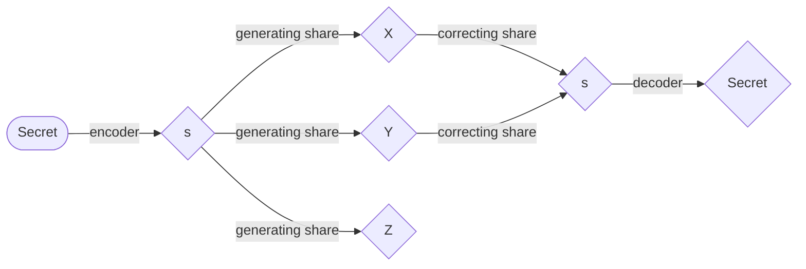

# 秘密分散法(Secret Sharing)

## 概要
秘密分散方式は，情報の秘密保持に関するかなり基礎的な理論に基づくセキュリティ技術です．
情報漏洩への耐性は，この分野で最も注目されている研究テーマの一つであり，暗号学分野の著名な国際会議であるCRYPTOでは，毎年この研究に関する論文が発表されています．

## 定義
秘密分散方式は，秘密情報を分散して管理するための方式です．
分散された後の情報は，一般に「シェア」と呼ばれます．
例えば，メッセージを秘密裏に送受信する場合，実際にはシェアが分散して送受信されるため，受信者が送信された情報を見たとしても，元のメッセージは分かりません．
ただし，受信側で元のメッセージを復元できるように，シェアを設定する必要があるのは言うまでもありません．
そのため秘密分散法では，送信者は「有資格集合」とよばれる参加者の集合族に含まれるシェアを集めた際には，秘密情報が一意に復元され，有資格集合に含まれない（禁止集合）シェアを集めても秘密情報に関する情報が一切漏れないということを保証します．
このことから秘密分散法は「**漏洩**」と「**紛失**」に強い暗号であるといえます．

シェアを生成するプロセスを以下に簡単に説明します．
まず，秘密情報を有限体 $`\mathbb{F}_{p}`$ 上の元に写像します．
この写像は単射である必要があります．
最初のステップは，秘密情報を要素数が素数 $`p`$ の有限体 $`\mathbb{F}_{p}`$ 上の整数として符号化することです．
有限体の詳細な説明は割愛しますが，体に関する詳細な解説は
>『ガロア理論12講 概念と直観でとらえる現代数学入門』（加藤 文元、2022年）

を参照してみてください．
ここでは $`\mathbb{F}_{p}=\lbrace0,1,\ldots,p-1\rbrace`$ であり，加算と乗算が $`p`$ の剰余演算（モジュロ演算）を用いて定義され，減算と除算はそれぞれの逆の演算を行うことで，四則演算がこの集合上で閉じていることを理解すれば十分です．
$`s`$ を符号化された整数値、$`n`$ をシェアの数，すなわち $`s`$ の分割の数とします．
$`n=3`$ の場合のシェア生成プロセスのイメージは，次のようになります．

## 秘密分散法の例
### $(k, n)$ しきい値法
秘密分散法の中で最も代表的で広く使われているモデルが「$(k, n)$ しきい値法」です．
多項式の性質を利用したシャミアの法（Shamir's Secret Sharing）などが有名です．
- $n$（参加者数）: 秘密情報を分割して作成するシェアの全体数です．
- $k$（しきい値）: 元の秘密情報を復元するために、最低限集める必要があるシェアの数です．

この方式では、$k$ 個以上のシェアを持ち寄れば元のデータを完全に復元できます。しかし、$k-1$ 個以下のシェアしか集まらなかった場合は、元の情報に関する手がかりを一切得ることができない（情報理論的安全性を満たす）ように数学的に設計されています．
例として最も簡単な $k = n, n - 1$ の二つの方式を紹介します．

### $(n, n)$ しきい値法
1～n-1番目のシェアは，一様乱数に基づいて生成します．
$X_n$ を $n$ 番目の参加者のシェアとし，これらは以下の方程式を満たすように生成されます．

$$
s+\sum_{i=0}^nX_i=0
$$

復号する際は $$n$$ 個のシェアが集まると，上記の連立方程式における未知数は，秘密情報のみとなります．
したがって，この方程式は一意の解をもちます．

### $(n-1, n)$ しきい値法
1～n-2番目のシェアは，一様乱数に基づいて生成します．
$X_{n-1}$ と $X_n$ をそれぞれ $n-1$ 番目および $n$ 番目の参加者のシェアとし，これらは以下の連立方程式を満たすように生成されます．

$$
s+\sum_{i=0}^nX_i=0
$$

$$
s+\sum_{i=0}^n\alpha^i X_i=0
$$

$\alpha$ は有限体 $`\mathbb{F}_{p}`$ の任意の原始元です．行列表記では，

$$
\begin{bmatrix}
1 & 1 \\
\alpha^{n-1} & \alpha^n \\
\end{bmatrix}
\begin{bmatrix}
X_{n-1}\\
X_n
\end{bmatrix}
=-
\begin{bmatrix}
s+\sum_{i=0}^{n-2}X_i\\
s+\sum_{i=0}^{n-2}\alpha^i X_i
\end{bmatrix}
$$

$$
\begin{bmatrix}
X_{n-1}\\
X_n
\end{bmatrix}
=(\alpha -1)^{-1}
\begin{bmatrix}
-\alpha & (\alpha^{n-1})^{-1}\\
1 & -(\alpha^{n-1})^{-1}
\end{bmatrix}
\begin{bmatrix}
s+\sum_{i=0}^{n-2}X_i\\
s+\sum_{i=0}^{n-2}\alpha^i X_i
\end{bmatrix}
$$

と表されます．

復号する際は $$n-1$$ 個のシェアが集まると，上記の連立方程式における未知数は，残りのシェアと秘密情報の2つだけとなります．
さらに，原始元が1ではないため，係数行列の次元は2です．
したがって，この連立方程式は一意の解をもちます．

## 秘密分散法の漏洩耐性
秘密分散法は，前述の通り漏洩に強い暗号方式であるが，ここでいう**漏洩**とは，攻撃者がいくつかのシェアを完全に得ることを指しています．
これまでサイドチャネルアタックのように，シェアの情報が部分的に漏洩する状況は議論されてきませんでした．
この状況への耐性は以下のような巡回行列（Cyclic Matrix）を用いることで解析できます．

$$
\begin{bmatrix}
c_0 & c_1 & \ldots & c_{n-2} & c_{n-1}\\
c_{n-1} & c_0 & \ldots & c_{n-3} & c_{n-2} \\
&&\vdots\\
c_1 & c_2 & \ldots & c_{n-1} & c_0
\end{bmatrix}
$$

つまり任意の行がその上の行の右シフトになっている行列です．
(左シフトも巡回行列ですが，ここでは右シフトのみを考えることとします．)
具体的には，この行列の以下のような性質を用います．

- 固有値・固有ベクトルが $$c_i$$ に依存しない
- 巡回行列同士の積は可換
- 同時対角化可能

## 参照
	加法型(n,n)しきい値法における1ビットLeakageの変動距離の評価, 古賀弘樹 阿部浩人, SITA2024
	加法型(n,n)しきい値法における1ビットLeakage間の最悪の統計的距離の一般公式, 阿部浩人 古賀弘樹, SITA2025
	New Tight Bounds on the Local Leakage Resilience of the Additive (n,n)-Threshold Scheme Determined by the Eigenvalues of Circulant Matrices, Hiroki Koga and Hiroto Abe, ASIACRYPT 2025
